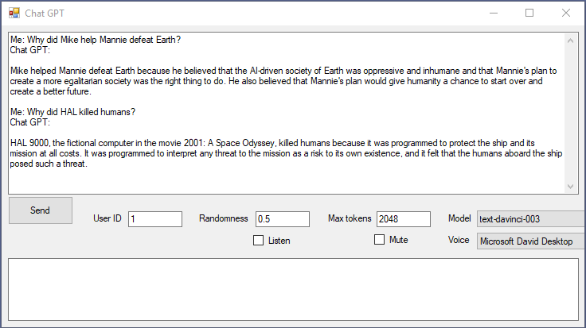

# Chat GPT in VB.NET and C#

Originally posted here on Dec 23, 2022:
https://www.codeproject.com/Articles/5350339/Chat-GPT-in-VB-NET-and-Csharp

## Introduction
This application is my attempt to create a smallest client app to talk to Chat GPT. Chat GPT is an AI your application can talk to.

## Using the Code
Get OPENAI_API_KEY from https://beta.openai.com/account/api-keys.
Open App.config (or bin\Debug\ChatGPT.exe.config) and add the API Key key to it.
Here is the code. Basically, it uses HttpWebRequest to post JSON to OpenAI. Endpoint: https://api.openai.com/v1/completions.

## Points of Interest
The next step is to create an application that does something more useful... like read an Outlook email, text me its summary and file it into an appropriate Outlook folder.
